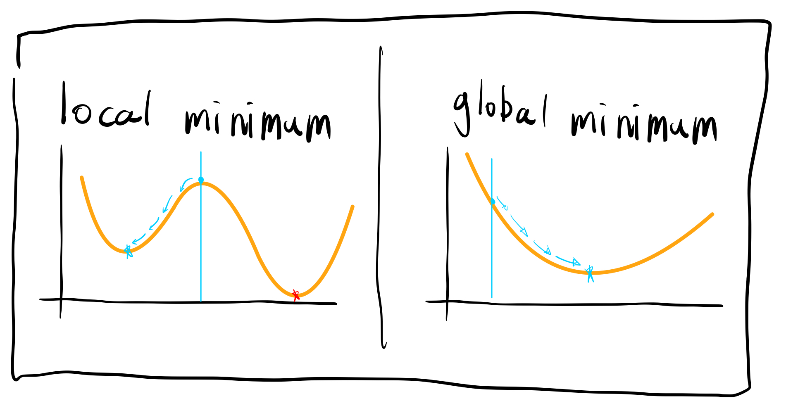

# 그리디 알고리즘(Greedy Algorithm)
탐욕 알고리즘이라고도 불리는 이 놈은 현재 상황에 있어서 가장 좋은 선택을 하는 알고리즘이다. 미래 따위는 생각하지않고 **각 단계에 있어서 가장 좋은 선택을 하는** <span style="color: red">상남자</span>(?) 알고리즘이라고 할 수 있다. 먼저 그리디 알고리즘을 적용 시킬 수 있는 조건에 대해 알아보자.
# 그리디 알고리즘을 적용할 수 있는 경우 - global minimum 찾기


문제 상황은 다음과 같은 그래프에서 최소값을 찾는다고 해보자. 그리디 알고리즘을 적용시키면 시작점에서 아래쪽으로만 가면된다. 첫 번째 그래프는 아래쪽으로 가서 최소값을 찾았지만 전역적인 최소값이 아니기에 그리디 알고리즘을 적용하기에 문제가 있다. 그리디 알고리즘을 적용하려면 두 번째 그래프와 같은 상황이여야 문제를 해결 할 수 있다.

# 문제 해결
[백준 1783 - 병든 나이트](https://www.acmicpc.net/problem/1783)

```python
n, m = map(int, input().split())

if n == 1: 
    cnt = 1
elif n == 2: 
    cnt = min(4, (m-1) // 2  +1)
elif m < 7:
    cnt = min(4, m)
else:
    cnt = m-2
print(cnt)
```